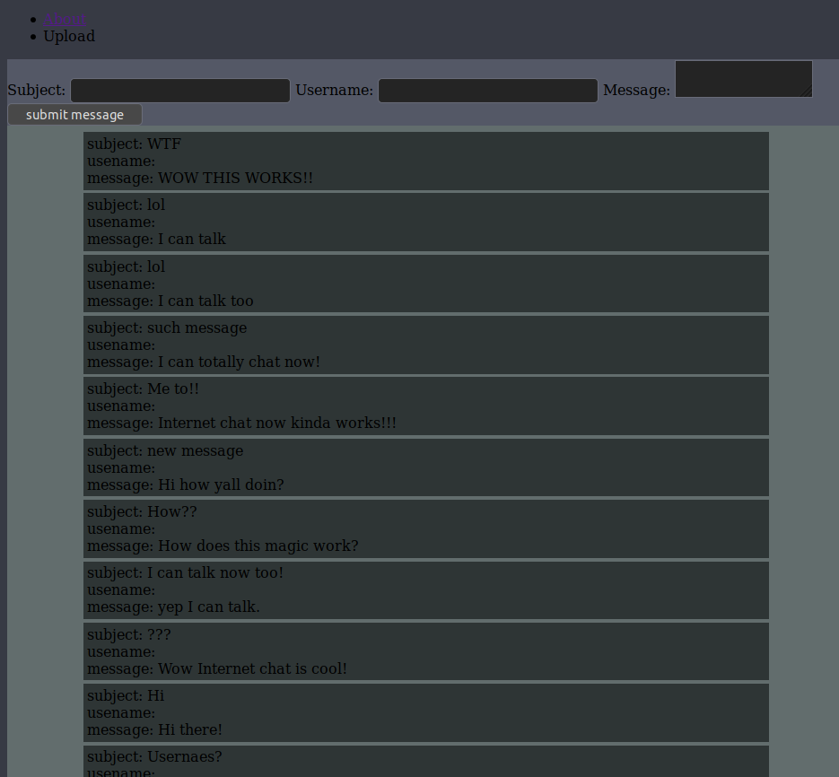
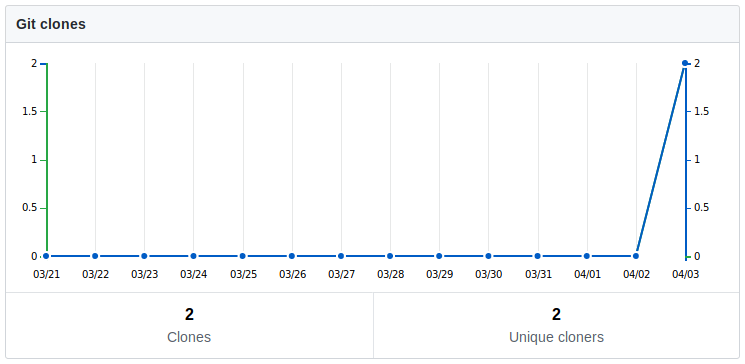

# What is this?
This is a simple chat server written in python. For the database it relies on a postgresql database and the server used that
database to store all of the data (I should write an ansible playbook for that). Currently it works but some work needs to 
be done to make it prettier secure and easy to setup.
# What is done
The minimum viable product. The server can send messages and retrieve them not much more.
# What needs to be done?
Basicly everything. The app is not pretty (see screenshot) and it is probably not secure. It could also be made easier to 
install.
# Screenshot:

# Clone
Wow someone other than me cloned by app. Thanks that is the first time that that has ever happened to me. Thanks!

